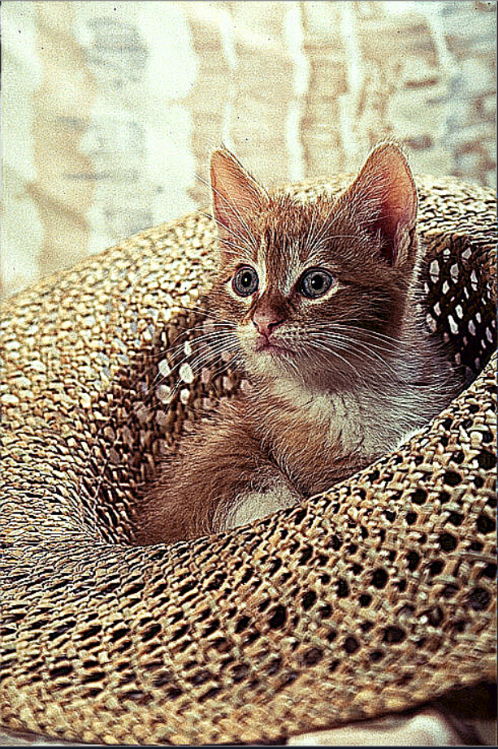

# Sharpening-Effect
Sharpening an image is a very basic method of image processing. In principle, image sharpening consists<br>
of adding to the original image a signal that is proportional to a high-pass filtered version of the original image

## Tools and Languages:


<br>

## Installation
Use the package manager [pip](https://pip.pypa.io/en/stable/) to install cv2 and numpy.


```bash
pip install cv2
pip install numpy
```

## Import
Use [import](https://www.w3schools.com/python/ref_keyword_import.asp) keyword to import modules.
```python
import cv2
import numpy as np
```

## Reading image from file

```python
img = cv2.imread("cat.png")
```


## Adding Sharpening effect
Image sharpening refers to any enhancement technique that highlights edges and,<br>
fine details in an image.<br>
Image sharpening is widely used in printing and photographic industries for increasing<br>
the local contrast and sharpening the images.<br>
```python
kernel_sharpening = np.array([[-1,-1,-1], 
                              [-1, 9,-1],
                              [-1,-1,-1]])
```
Above we are adding a kernel enabled with an array of values used to normalize the pixel values.<br>
You can play with the values we have entered to change the amount of sharpening.<br>
```python
sharpened = cv2.filter2D(img,-1,kernel_sharpening)
```
Here we used *cv2.filter2D( )* function in order to produce our sharpen image. Here the kernel and<br>
input image are filtered.<br>
This function takes 3 args *input image* , *Desired depth* & *kernel values*. <br>

## Completion message

```python
print('Image Sharpened.')
```

## comparing original vs resized

```python
cv2.imshow('ORIGINAL',img)
cv2.imshow('SHARPEN',sharpened)
cv2.waitKey(0)
cv2.destroyAllWindows()
```

## Images
<p align="center">
       
       
</p>
	

### Developed by
 [Ashish ku. Behera](https://github.com/ashish-max "Github Id")
